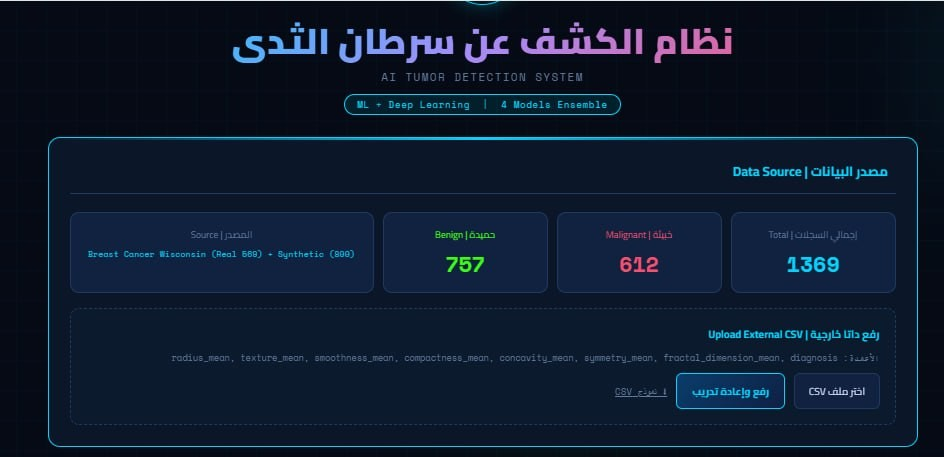
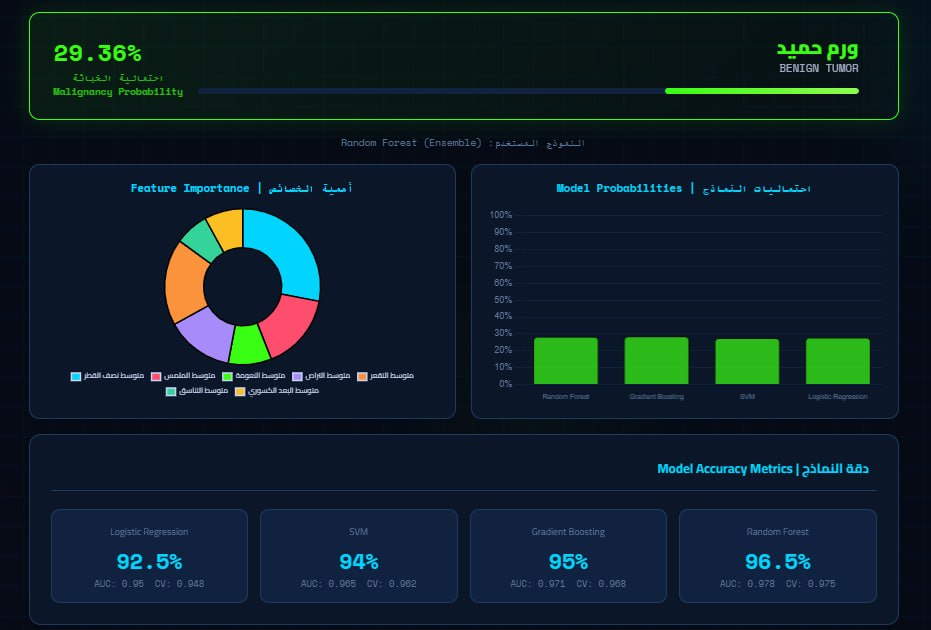

# AI Tumor Detection System

<p align="center">
  
</p>

<p align="center">

AI-powered Tumor Detection System using Machine Learning and Deep Learning for clinical data analysis and biopsy image classification.

</p>

---

# Overview

Early detection of tumors is one of the most important factors in improving treatment outcomes and reducing medical costs. However, diagnosis often requires multiple laboratory tests, medical imaging, and specialist evaluation, making the process time-consuming and expensive.

This project provides an AI-powered decision support system that helps analyze tumor cases using two different approaches:

- Clinical data prediction using Machine Learning models.
- Biopsy image classification using Deep Learning.

The system is designed to assist healthcare professionals by providing fast predictions based on trained AI models. It is intended to support medical decision-making rather than replace professional diagnosis.

---

# Problem

Many patients undergo numerous medical examinations before receiving a diagnosis.

This leads to:

- Long waiting times.
- High medical costs.
- Increased workload for healthcare professionals.
- Possibility of human error during diagnosis.
- Delayed treatment for serious cases.

---

# Solution

The system provides two AI-based diagnosis methods:

### Clinical Prediction

Users enter seven important clinical features into the system.

The trained Machine Learning models analyze these values and predict whether the tumor is:

- Benign
- Malignant

along with the prediction confidence.

---

### Image Classification

Users upload a biopsy ultrasound image.

A Deep Learning CNN model based on Transfer Learning analyzes the image and predicts whether the tumor is benign or malignant.

---

# Key Features

- Clinical tumor prediction using Machine Learning.
- Image-based tumor classification using CNN.
- Multiple trained ML models for comparison.
- REST API integration using Flask.
- User-friendly web interface.
- Real-time predictions.
- Deployable web application.
- Medical decision support.

---

# System Workflow

Patient

↓

Enter Clinical Data

or

Upload Ultrasound Image

↓

Flask API

↓

Machine Learning / CNN Model

↓

Prediction

↓

Diagnosis Result

---

# Technologies Used

| Category | Technologies |
|-----------|-------------|
| Programming Language | Python |
| Backend | Flask |
| Machine Learning | Scikit-learn |
| Deep Learning | TensorFlow, Keras |
| Computer Vision | OpenCV, Pillow |
| Data Processing | Pandas, NumPy |
| Deployment | Render, Gunicorn |
| Version Control | Git, GitHub |

---

# Project Structure

```
AI-Tumor-Detection/
│
├── models/
│   ├── cnn_model.py
│   ├── tumor_model.py
│   └── __init__.py
│
├── templates/
│   └── index.html
│
├── screenshots/
│
├── app.py
├── train_cnn.py
├── split_data.py
├── requirements.txt
├── README.md
└── .gitignore
```

---

# Screenshots

### Home Page

<p align="center">

</p>

### Clinical Prediction

<p align="center">

</p>

### Image Classification

<p align="center">

</p>

---

# Model Performance

| Model | Accuracy | AUC |
|-------|----------|------|
| Random Forest | **96.5%** | **0.978** |
| Gradient Boosting | 95.0% | 0.971 |
| SVM | 94.0% | 0.965 |
| Logistic Regression | 92.5% | 0.950 |
| CNN (Transfer Learning) | 85% | 0.89 |

---

# API Endpoints

The application exposes simple REST endpoints for real-time prediction.

| Endpoint | Method | Description |
|----------|--------|-------------|
| `/` | GET | Home Page |
| `/predict` | POST | Clinical Data Prediction |
| `/predict-image` | POST | Tumor Image Classification |

---

# Installation

Clone the repository

```bash
git clone https://github.com/Shfaa2000/tumor-detection-system.git
```

Move into the project directory

```bash
cd tumor-detection-system
```

Create a virtual environment

```bash
python -m venv venv
```

Activate the environment

Windows

```bash
venv\Scripts\activate
```

Linux / macOS

```bash
source venv/bin/activate
```

Install dependencies

```bash
pip install -r requirements.txt
```

Run the application

```bash
python app.py
```

Open your browser

```
http://127.0.0.1:5000
```

---

# Dataset

The project uses two datasets.

## Clinical Dataset

Breast Cancer Wisconsin Dataset

Contains the most important clinical features used for tumor diagnosis.

The dataset is used to train and evaluate multiple Machine Learning algorithms.

---

## Image Dataset

Breast Ultrasound Images Dataset

Contains ultrasound images labeled as:

- Benign
- Malignant
- Normal

The image model uses Transfer Learning to improve performance while reducing training time.

---

# Machine Learning Pipeline

Clinical Prediction Pipeline

```
Raw Data

↓

Data Cleaning

↓

Feature Selection

↓

Train/Test Split

↓

Model Training

↓

Evaluation

↓

Prediction
```

---

Image Classification Pipeline

```
Image

↓

Resize

↓

Normalization

↓

Transfer Learning

↓

Fine Tuning

↓

Prediction
```

---

# Results

The project successfully combines Machine Learning and Deep Learning into a single medical decision support system.

Achievements include:

- Clinical prediction accuracy up to **96.5%**
- CNN image classification accuracy of **85%**
- REST API integration for real-time predictions
- Web-based interface for easier accessibility
- Comparison between multiple Machine Learning algorithms
- Deployable application on Render

---

# Challenges

During development several challenges were addressed:

- Selecting the most informative clinical features.
- Improving image quality before prediction.
- Choosing the most suitable Machine Learning model.
- Handling limited medical image data.
- Integrating AI models with the web application.
- Deploying the application while maintaining model performance.

---

# What I Learned

This project significantly strengthened my practical experience in AI development.

Key skills gained include:

- Building end-to-end Machine Learning applications.
- Developing Deep Learning models using TensorFlow.
- Applying Transfer Learning in medical imaging.
- Training and evaluating multiple ML algorithms.
- Integrating AI models into Flask applications.
- Building REST APIs.
- Working with image preprocessing using OpenCV.
- Deploying AI applications to the cloud.
- Structuring production-ready Python projects.

---

# Future Improvements

Potential future enhancements include:

- Support additional medical imaging modalities.
- Increase dataset size for better generalization.
- Add explainable AI (XAI) visualizations.
- Implement user authentication.
- Store prediction history in a database.
- Dockerize the application.
- Deploy using CI/CD pipelines.
- Add multilingual support.

---

# Author

**Shfaa NoorAldeen Nakour**

Python Developer

Machine Learning • Deep Learning • Computer Vision • Automation

GitHub:
https://github.com/Shfaa2000

LinkedIn:
https://linkedin.com/in/shfaa-nakour-45a000339

Email:

nakourshfaa@gmail.com

---

# License

This project is intended for educational and research purposes.

It is not intended to replace professional medical diagnosis.

Healthcare decisions should always be made by qualified medical professionals.
